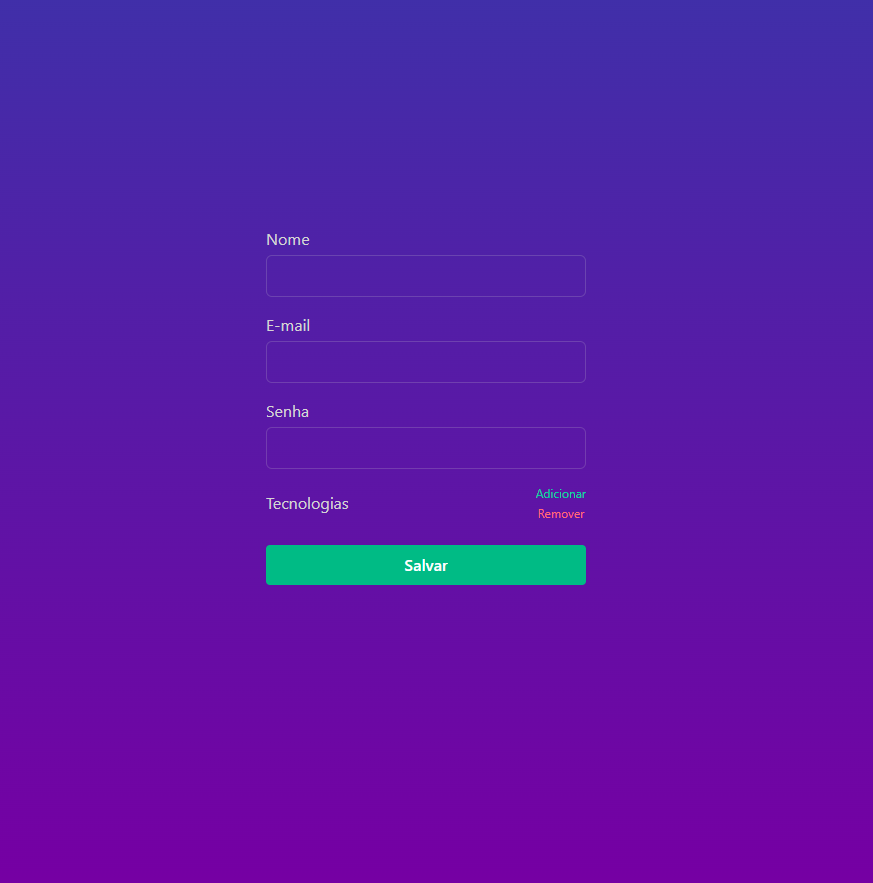

## Formulários - Validação Avançada

O intuito desse projeto é praticar a validação de formulários em React de maneira segura utilizando TypeScript.

 

## Tecnologias utilizadas no projeto:

- ViteJS (boilerplate w/ TypeScript)
- TailwindCSS (p/ estilização rápida)
- React Hook Form
- HookForm Resolvers
- Zod

 

## [Preview](https://form-validacao-avancada.vercel.app/)

